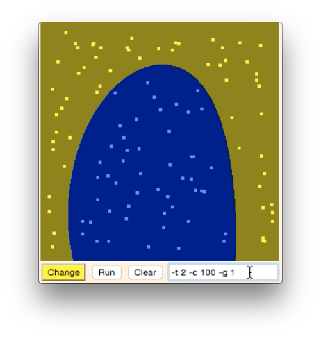

# SVMs
## gabe heafitz
^ very brief mention of what SVMs are: a popular, easy-to-use machine learning algorithm

#### © 2015 Gabe Heafitz

---

# me
- Ruby / iOS engineer at ShopKeep
- @Noreaster76 on GitHub and Twitter (but don't follow me)
- [gabe@shopkeep.com](mailto:gabe@shopkeep.com)

---

# ShopKeep
- iPad-based point of sale system
- really easy to use, freakin' sweet interface
- $49/month/register
- we help the mom & pop shops compete with the big boys
- ~274 employees
- headquartered here in NYC; 5 offices globally
- Ruby, iOS, Go, and Scala
- data science team

---

# okay, so, wonderful, but what can we do with SVMs?
- handwriting recognition
- identifying the most promising sales leads
- e-commerce fraud detection
- detect heart disease?

^ for something like e-commerce fraud detection, we could use a particular kind of SVM called a one-class SVM, which is a bit different from a two-class SVM in that you don't need to label the training data yourself. this is a kind of unsupervised learning called anomaly detection or novelty detection. see [scikit-learn](http://scikit-learn.org/stable/modules/svm.html#density-estimation-novelty-detection) for more info.

---

## plan of attack
1. demo of SVM running on some example data
1. interpreting the results
1. review of fundamental concepts of machine learning; how is machine learning helpful?
1. how do SVMs work?
1. how do you train an SVM?
1. some classic usage examples
1. some publically available implementations

---

# demo
## train an SVM against example data

---

# example: can we predict heart disease?
## what does our data look like?
## heart dataset from UCI

```
age  sex     bp                  hr                        ?
63.0 1.0 1.0 145.0 233.0 1.0 2.0 150.0 0.0 2.3 3.0 0.0 6.0 1
67.0 1.0 4.0 160.0 286.0 0.0 2.0 108.0 1.0 1.5 2.0 3.0 3.0 0
67.0 1.0 4.0 120.0 229.0 0.0 2.0 129.0 1.0 2.6 2.0 2.0 7.0 1
37.0 1.0 3.0 130.0 250.0 0.0 0.0 187.0 0.0 3.5 3.0 0.0 3.0 0
41.0 0.0 2.0 130.0 204.0 0.0 2.0 172.0 0.0 1.4 1.0 0.0 3.0 0
56.0 1.0 2.0 120.0 236.0 0.0 0.0 178.0 0.0 0.8 1.0 0.0 3.0 0
```

^ 1. age 2. sex 3. chest pain type (4 values) 4. resting blood pressure 5. serum cholesterol in mg/dl 6. fasting blood sugar > 120 mg/dl 7. resting electrocardiographic results (values 0,1,2) 8. maximum heart rate achieved 9. exercise induced angina 10. ST depression induced by exercise relative to rest; 11. the slope of the peak exercise ST segment, 12. number of major vessels (0-3) colored by flourosopy; 13. thal: 3 = normal; 6 = fixed defect; 7 = reversable defect; 13. 2 if heart disease, 1 if no heart disease.

---

1. age
2. sex
3. chest pain type  (4 values)
4. resting blood pressure
5. serum cholesterol in mg/dl
6. fasting blood sugar > 120 mg/dl
7. resting electrocardiographic results  (values 0,1,2)
8. maximum heart rate achieved
9. exercise induced angina
...

---

# okay, finally ready to SVM
## let's download, compile, and run an open-source SVM library

---


---

# demo
## evaluate the results
^ the absolute baseline performance we could expect from the algorithm is if we just predicted the same for every example in the validation set the most common response from the training set. so, in this case, out of the 170 rows in the training set, 76 correspond to cases in which the patient did in fact have heart disease, and 94 correspond to patients without heart disease. as a result, the most common case in the training data was that the patient did not have heart disease. you could therefore just predict there is no heart disease for all examples, since that is what is most common. and you'd be right 56% of the time for the validation set that we're using. but there's not much nuance or logic in just predicting whatever was the most common. we can do better than that (and if your learner isn't even beating baseline, something is wrong). in this case, our basic SVM got 85% of the predictions right for the validation set. not bad, for an off-the-shelf library we compiled in less than a second, trained in less than a second, shoved a bunch of data into, and got predictions from in less than a second. but best of all, it enabled us to make pretty good predictions without attending medical school and training to become a doctor, for example. we extracted knowledge from a bunch of data we had on hand and can apply that knowledge to unknown data in the future.

---

# what ML is for
## finding patterns in the data
^ machine learning algorithms earn their keep by finding patterns in raw data (well, raw data that has been encoded in a way that the machine learning algorithm can ingest, and also, in many cases, has also been massaged to remove data deemed irrelevant or to normalize data with high variance)

---

machine learning uses statistics. in engineering, we're used to solving a deterministic problem where our solution solves the problem all the time. if we're asked to write software to control a vending machine, it had better work all the time, regardless of the money entered or the buttons pressed. there are many problems where the solution isn't deterministic.

---

that is, we don't know enough about the problem or don't have enough computing power to properly model the problem. for these problems we need statistics.
-- from Machine Learning in Action, by Peter Harrington

---

# terminology


---

# attribute
## one of the columns in your data
examples from the heart data set:
- age
- gender
- chest pain type (this is a set of 4 nominal values)
- resting blood pressure
- serum cholesterol in mg/dL
- fasting blood sugar > 120 mg/dL

---

# classification
## tell me which of 2 classes the row of data fits in
example from the heart data set:
whether heart disease is present or absent

^ note that we're just talking about 2-class classification here. there are lots of cases in which you want to predict which of n classes a particular row of data fits in, but today, we'll just focus on 2-class, or binary, classification.

---

# 2 attributes of the heart data set

- age
- maximum heart rate

^ we'll start by discussing just these 2 arbitrarily chosen attributes, but later, we're going to discuss training models that take potentially many more than 2 attributes in a data set into account.

---


---

# you divide your data into subsets
1. training set
1. validation set
1. test set
1. production data

^ the data you have on hand when training your model is divided into these subsets like these, but this isn't a strict rule. naturally, as you can imagine, they all have a part in the ML process, and you proceed in order from top to bottom.

---

# training set
^ this is a subset of the data you have at the time of training the machine learning algorithm. in general, the more training data you have, the better, since it allows you to train a more generalized model and one that is less prone to variance in a couple of data points. that is, if you only had a small sample of data on which to train your model, your model might weight a little variation in one of the attributes too sensitively or not sensitively enough, for example.

---

# validation set

^ this is a subset of the data you do not use for training the model.  instead, you run the trained model against it, and because it wasn't used in training the model, the idea is that it will give you a decent idea of how your model would perform if you ever used it in production on data points for which you truly do not have the answers. however, because you train models using different parameters or configurations and then run those models on the validation data, and you repeat this process several times until you've found a set of parameters or a configuration that performs well, you can no longer really claim that the validation data was not involved at all in the training of the model. and that's why we set aside yet more rows of data in a final test set, so that when we publish a paper or something to that effect, we can run the model we finally settled on against data points that are truly unknown to it, that had no involvement in its development.

---

# test set

---

# knowledge representation
can a human interpret the patterns that the machine has found, or is the model an opaque black box?

---

## how to train and use a machine learning model

---

# step 1
## collect a data set

---

# step 2
## encode the data set in such a way that the machine learning algorithm will be able to ingest

---

# step 3
## filter out any known noise or other useless attributes or rows in the data, so that the machine learning algorithm doesn't get distracted by something you know to be irrelevant

---

# step 4
## train the algorithm: "you feed the algorithm good clean data from the first two steps and extract knowledge or information." the "knowledge" or "information" *is* your model

---

# step 5
## exercise your model on the validation set -- this will show how well your model performs with unknown data

^ has your model overfit the training data, or is it a model that reflects a truly general pattern in the data and will perform well in the future when supplied with data points that have some variance in their attribute values?

---

# step 6
## use your model in production. you may want to periodically re-train your model, as you collect more data in your system

---

# step 7[^1]
## profit?

[^1]: This one's not from the Harrington book. I added this one myself.

---

# how SVMs work

---

# linear kernel


---


^ generally, a linear kernel requires the least amount of time to train, and works best if your data is linearly separable. it works very much like trying to position an infinitely long yardstick in such a way that it will be the farthest away from all of the datapoints and best separate them into the two separate classes you're trying to predict; the datapoints closest to it that most influence its position and slope are the support vectors and are the reason we call this learning algorithm a support vector machine.  however, the metaphor of the infinitely long yardstick can only be applied literally if you have 2 attributes in your data, because you're trying to separate two 2-dimensional clouds of data points. but the heart data we were looking at earlier had not 2 attributes, but 13!! how do we get there? well, if you have 2 attributes, or columns of data, you're positioning an infinite yardstick. if you have 3 attributes, or columns of data, you're trying to position an infinite plane. if you have 4 attributes, you're trying to position a plane in 4 dimensions (not that we can easily visualize that), and so on. so, as far as the heart data goes, you're trying to position a flat plane in 13-dimensional space. but whether you're talking about a line or a plane, regardless of the number of dimensions, we call the line or plane that separates the data the separating hyperplane. and it's the separating hyperplane that we're trying to find throughout all this, so that in the future, we can plot an unclassified or uncategorized data point, and, based on which side of the hyperplane the data point falls, we will have a prediction for which class or category applies to it.

---

# demo of linear kernel SVM


---

# but what if the data are not linearly separable?
## slack variables allow us some room for error and to find a line that doesn't necessarily separate the data perfectly, but still to do the best job we can

---

# slack allows for some error


---

# [fit] what if the data are _really_ not linearly separable?


^ we've looked at trying to fit a line or a plane to the data in such a way that will best separate one class (say, no heart disease) from the other class (presence of heart disease). we've also discussed what happens if the data overlap a bit and you have to fit the line or plane in such a way that a couple of the training data points fall on the wrong side, with slack variables. but there are cases in which even with slack variables, you still will end up with pretty bad performance.

---

# [fit] what if the data are _really_ not linearly separable?
## higher order SVMs
- polynomial function
- Gaussian radial basis function

^ these higher order kernels take longer to train, but they are much more powerful than linear kernels for fitting more complex datasets.  depending on your data, you can get much more accurate predictions on your unknown data.

---

# higher order SVMs


---

# what is going on here?

^ how do these higher order kernels, the polynomial and Gaussian functions work?

---

# data that can't possibly be separated by a straight line


^ here you have data points in 2 dimensions that can't possibly be separated by a straight line. but what if you BENT the 2 dimensional space?

---

# data that can't possibly be separated by a straight line


^ bang. if you apply one of these higher order kernel functions to your data, you can find a straight line, or hyperplane, that separates your data.

---

## another example, this time in 3-D


---


---


---

# gaussian radial basis function parameters
- C
- gamma

---

## C, the cost parameter


^ C is the cost parameter, or how willing we are to settle for a margin that doesn't perfectly separate the data points in the training set.

---

## gamma, the spikiness parameter


^ "A large gamma gives you a pointed bump in the higher dimensions, a small gamma gives you a softer, broader bump." now, even though a high gamma seems to more tightly hug the blue data points, we've lost the sense of the overall true function, which was mostly a simple parabola.

---

# underfitting / overfitting



^ a goldilocks and the three bears kind of situation applies to machine learning. has your model not approximated the true data closely enough (by not giving the signal enough weight), which we see in the left column, has it approximated it _too_ well (by giving noise too much weight), which we see in the right column, or has it approximated it just right, which we see in the center? not that one is necessarily worse than the other, but we do especially watch out for overfitting in training our models and employ tactics to avoid it. i think it's because we'd prefer to be pessimists and say we don't know than be optimists and make claims our models can't necessarily support.

---

# gaussian radial basis function parameters
- C: the cost parameter
- gamma: controls sharpness of bumps

^ we typically try to home in on the best combination of C and gamma by searching a grid of possible combinations.

---

# SVMs: the advantages and disadvantages

---

# advantages
- widely considered to be the best "stock" learning algorithm
- relatively very simple to configure and require very little tuning of parameters

^ you can take the SVM algorithm right off the shelf, and train a learner on your data and get very good or excellent performance on it. witness the performance of SVMs on analyzing handwritten digits: an SVM with a relatively simple configuration correctly identified a handwritten digit ~98.6% of the time, whereas a top-of-the-line artificial neural network delivered ~99.75% accuracy. the artificial neural network therefore made 1/6 the number of errors that the SVM did, but still, that ~98.6% figure sure isn't bad for an off-the-shelf algorithm.

---


---

# disadvantages

- black box: tough to extract knowledge representation

^ as opposed to some other machine learning algorithms, such as decision trees, the various weights an SVM assigns to the attributes in your data are not something you can take away an understanding from, draw conclusions from, and take action on. you can't extract knowledge on, say, which attributes of the heart dataset are most highly correlated with risk of heart disease so that you can go issue public health advisories, or which attributes of your sales data highlight the best sales leads so that you can advise your marketing team accordingly. so, it depends on whether you just want an answer (classify an unknown data point into a certain category) or, instead, you want greater understanding from your data.

---

# disadvantages
- can be slow

^ according to [scikit-learn](http://scikit-learn.org/stable/modules/generated/sklearn.svm.SVC.html), the time to train a higher dimension SVM grows by more than O(n^2) (where n is the number of training examples), so, much beyond 10,000 examples, you're looking at a long time to train.

---

# disadvantages
- but not too bad if you're using a linear kernel

^ however, with a linear SVM (one where you're just trying to linearly separate data, like with a yardstick), the performance is O(n).

---

# popular real-world applications of SVMs

- text categorization
- image classification
- protein classification in medical research
- handwritten character recognition

---

# popular SVM implementations
## and they're easy to use, too!
- [LibSVM](http://www.csie.ntu.edu.tw/~cjlin/libsvm/index.html)
- [SVMLight](http://svmlight.joachims.org/)
- [scikit-learn](http://scikit-learn.org/)

---
# [fit] easy to use in your own code
- nice, clear APIs
- python example, using scikit-learn

```python
from sklearn.svm import SVC

X = ... # my training data
y = ... # my training labels (the class or classification of each training data point)

clf = SVC(C=1.0)
clf.fit(X, y)

X_test = ... # my production data

predictions = clf.predict(X_test)

# done!
```

---

# popular machine learning libraries
## import your data once and run it on any number of both popular and obscure ML algorithms (SVMS or otherwise)
## adapters for calling from many popular languages, including Ruby

- [Weka](http://www.cs.waikato.ac.nz/ml/weka/) -- written by kiwis
- [Shogun](https://github.com/shogun-toolbox/shogun) -- on github but looks like it's a giant pain to use, with confusing documentation
- [scikit-learn](http://scikit-learn.org/)
- [Matlab](http://www.mathworks.com/products/matlab/) -- but not open source

---

# summary cum laude
1. demo of SVM running on some example data
1. interpreting the results
1. review of fundamental concepts of machine learning
1. how do SVMs work?
1. how do you train an SVM?
1. some classic usage examples
1. some publically available implementations

---

# harrington book


---

# i have a book available to give you


---

# [fit] does anyone have any questions?
## examples:
- are SVMs a good source of riboflavin?
- can i wash my cat with an SVM?

---
# fin


